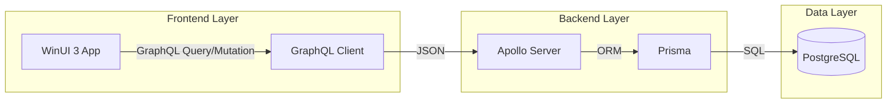

# MyShop - E-commerce Management System

A modern desktop application for managing products, orders, customers, and generating business reports. Built with a **Client-Server architecture** using **WinUI 3 (Frontend)** and **Node.js + GraphQL (Backend)**.

---

## 🔧 Prerequisites

Install these before starting:

| Software | Required | Purpose |
|----------|----------|----------|
| Visual Studio 2022 | ✅ | Frontend development |
| .NET 8.0 SDK | ✅ | Frontend development |
| Node.js (v18+) | ✅ | Backend development |
| Docker Desktop | ✅ | PostgreSQL Database |
| Git | ✅ | Version control |

---

## 🏗️ Architecture



---

## Installation & Setup

### 1. Clone Repository

```bash
git clone https://github.com/YOUR_USERNAME/MyShop.git
cd MyShop
```

### 2. Database Setup

Ensure Docker Desktop is running, then start the PostgreSQL container from the backend directory:

```bash
cd src/MyShop.Backend
docker-compose up -d
```

### 3. Backend Setup (Node.js + GraphQL)

```bash
cd src/MyShop.Backend

# Install dependencies
npm install

# Setup environment variables
cp .env.example .env

# Generate Prisma client and migrate database
npx prisma generate
npx prisma migrate dev --name init

# Seed initial data (Admin user, Categories)
npm run seed
npm run seed:admin

# Start backend server
npm run dev
```
*Backend will be running at: `http://localhost:4000/graphql`*

### 4. Frontend Setup (WinUI 3)

1. Open `src/MyShop.sln` in **Visual Studio 2022**.
2. Right-click `MyShop.App` → **Set as Startup Project**.
3. Verify that `GraphQLService` in `App.xaml.cs` points to your backend URL.
4. Press `F5` to run.

---

## 📁 Project Structure

```
MyShop/
├── src/
│   ├── MyShop.App/         # WinUI 3 Frontend Application (UI & ViewModels)
│   ├── MyShop.Backend/     # Node.js + GraphQL + Prisma Backend (Logic & Database)
│   ├── MyShop.Core/        # Domain Models & Repository Interfaces
│   ├── MyShop.Data/        # GraphQL Repository Implementations
│   └── MyShop.Tests/       # Unit & Integration Tests
└── README.md                # This file
```

---

## � Useful Commands

### Backend Commands
- `npm run dev`: Start dev server with nodemon
- `npx prisma studio`: Open GUI to manage database data
- `npx prisma migrate dev`: Create and apply database migrations

### Frontend Commands
- `dotnet build`: Build the solution
- `dotnet run --project src/MyShop.App`: Run the app via CLI

---

### Coding Standards
- **Backend:** TypeScript, follow ESLint and Prettier rules.
- **Frontend:** C# Coding Conventions, MVVM Pattern.

---

## 🐛 Troubleshooting

- **CORS Error:** Ensure the backend allowed the frontend's origin in `src/index.ts`.
- **Database Connection Failure:** Check if `.env` in `MyShop.Backend` has the correct `DATABASE_URL`.
- **GraphQL Client Error:** Ensure the backend is running before starting the WinUI app.

---
**Version:** 1.1 (GraphQL Transition)  
**Last Updated:** Dec 2025